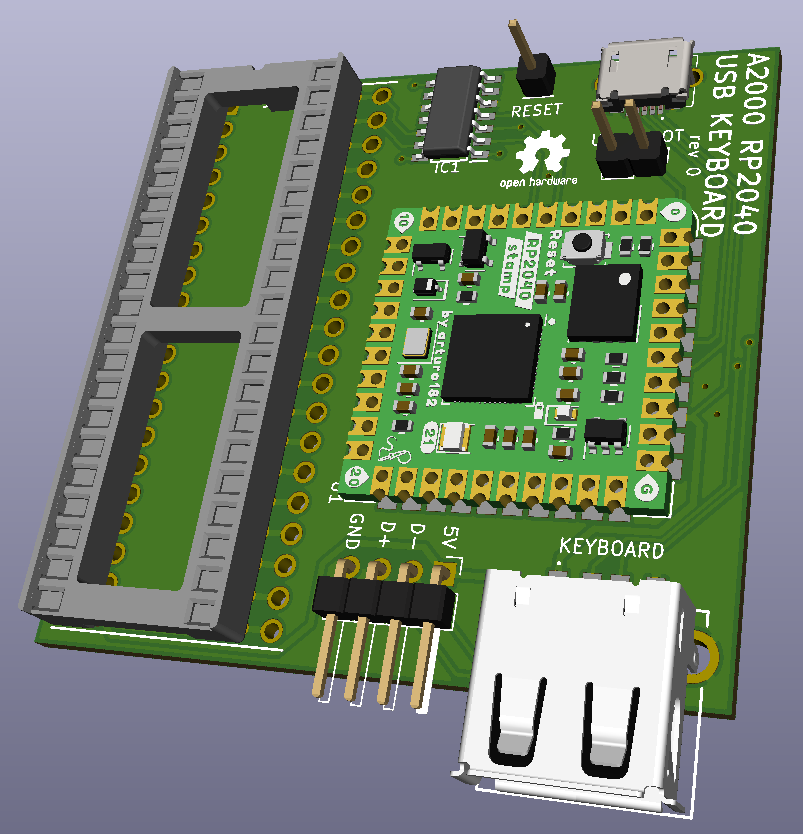

# A2000-USB-Keyboard-Adapter-RP2040
A USB keyboard adapter for the Amiga 2000 based on the Pi Stamp RP2040

## Intro
This is a USB keyboard adapter I designed a board for to use in the Amiga 2000. It is based on the amigahid-pico firmware by borb (nine), as well as my other A500 USB adapter. The KiCAD files, Gerbers, and BOM are in this repository. The completed board attaches to the CIA socket and provides a USB inputs for your interface device.

* This has not been built/tested yet. Use at your own risk.

## Parts
* PCB: PCB's can be ordered from JLCPCB by uploading the Gerber files, but any PCB house should be able to make these since it is a simple/small design. (PCBway, OSH Park, AllPCB, etc.)
* Pi Stamp RP2040: https://shop.pimoroni.com/products/rp2040-stamp
* All other PCB mounted components were sourced at Mouser per the BOM. Other sources for the components could be Digikey, Farnell, RS, etc. depending on what is available in your location. Chip/component shortages may impact your ability to get everything all in one place. Substitutions may need to be made.
* You will need to find a pin header to USB cable that suits your case needs, or a USB PCI bracket, possibly with an extension. (Amazon, Ebay, Aliexpress, etc.)

## Building the Adapter
* Solder the smallest SMD components first. (resistors, capacitors, logic level shifter, MicroUSB connector)
* Solder the right angle pin connector. (USB header)
* Solder the Pi Stamp RP2040 into place. You can solder directly onto the board, or optionally use the male and female headers to socket mount it. I recommend using the male and female pin headers so you can easily pull the RP2040 out if you need to use it again in the future on another project.
* Solder the USB type-A connector.
* Solder the vertical USB_BOOT header and reset pin into place. You can skip the reset pin if you're soldering a wire directly to the board instead.
* Solder the two 20-pin machine pin headers to the bottom of the PCB.
* Solder the 40-pin DIP socket.
* I recommend checking all solder joints under magnification to ensure everything is connected with no shorts.

## Flashing the Firmware
First off, a huge thank you to Nine for developing the amigahid-pico, as this design uses its firmware. Firmware is located at: https://github.com/borb/amigahid-pico/
1. Build the firmware per the instructions at https://github.com/borb/amigahid-pico/blob/main/doc/installation.md
2. Place a jumper on the USB_BOOT pin.
3. Plug a MicroUSB cable to the PCB's MicroUSB port and plug the other end into the PC you just compiled the firmware on. It will then show up as a mass storage device.
4. Remove the jumper from the USB_BOOT pin.
5. Copy the amigahid-pico.uf2 file from the "build/src/" directory you compiled to the RP2040's mounted USB storage volume. It will then disconnect/reset.
6. Disconnect the USB cable from the PC and keyboard adapter PCB.

## Installation into the Amiga
1. Gain access to your Amiga 2000 motherboard. This will require removing the top lid, as well as the PSU/3.5/5.25 mezzanine chassis.
2. Remove the U300 CIA chip and install the keyboard adapter board into its place, paying attention to orientation.
3. Plug the CIA chip into the DIP socket of the keyboard adapter, paying attention to orientation.
4. Plug your USB cable into the pin header, or USB cable into the USB type-A port.
5. Install the USB bracket into a spare ISA/Zorro slot.
6. Connect a wire from the Reset pin on the keyboard adapter PCB to Gary chip Pin #5. I find that a small spring loaded test lead works best for easy install/removal. 
7. Plug the keyboard or wireless keyboard adapter into the newly installed USB port at the rear of the A2000.
8. Boot the Amiga and test it out!

## Optional Stuff
* USB HID mouse support is included in Nine's firmware, but none of the mice I used would work with the A500 adapter which is nearly identical in terms of design. I use a DB9 connected OpenLaserMouse anyway, but maybe you'll have better luck testing various mice to see if one works. I know the firmware is still an in-progress project, or maybe I didn't do something right when I compiled the firmware. 
* Amiga keys are currently mapped to right and left windows keys. Before compiling the firmware, you can modify those keys if necessary at your own discretion.

## Miscellaneous
This board is provided as-is and open source. It does not provide firmware and relies on a different project as linked above. This specific project is untested. Review the design and build/test at your own risk.
If you plan to sell this board, firmware is per the license at: https://github.com/borb/amigahid-pico/
